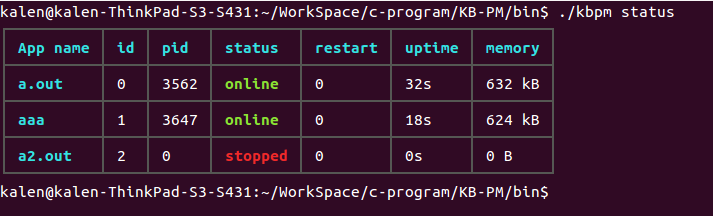

# KB-PM
a CLI tool (like supervisor and pm2) keep a group of programs running continuously.

## Screenshot
<br>

## Installation
``` shell
git clone https://github.com/nladuo/KB-PM.git
cd KB-PM && make && sudo make install
```
## Example
``` shell
kbpm service start              # start the KB_PM service
chmod +x ./bin/test.sh          # make test.sh executeable
kbpm start ./bin/test.sh        # execute test.sh, use absolute path or relative path
tail -f test.log                # check out the stdout of test.sh
```
## Log
KB_PM use syslog for logging, you can check the log at /var/log/syslog

## License
MIT